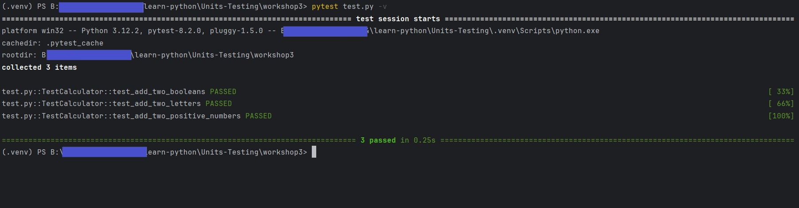

#Unit test with pytest
Run test:
 pytest test.py -v (to run test)

#Generate report in html format:
 pip install pytest-html

 pytest workshop4/test.py -v --html=workshop4.html
 The command above will generate both report workshop4.html 
 and assets directory for CSS(for styleSheet) at the project root

