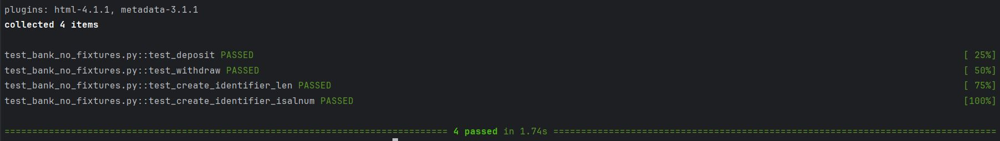

# Units Testing with Fixtures:

If you're using pycharm go to :SETTINGS/TOOLS/PYTHON INTEGRATED TOOLS
Change default testing option to pytest and back to the code to generate
unit test with pytest directly(preferences are only for current project)

pytest workshop5/test_bank.py -v (to run a test)

# Testing without Fixtures

